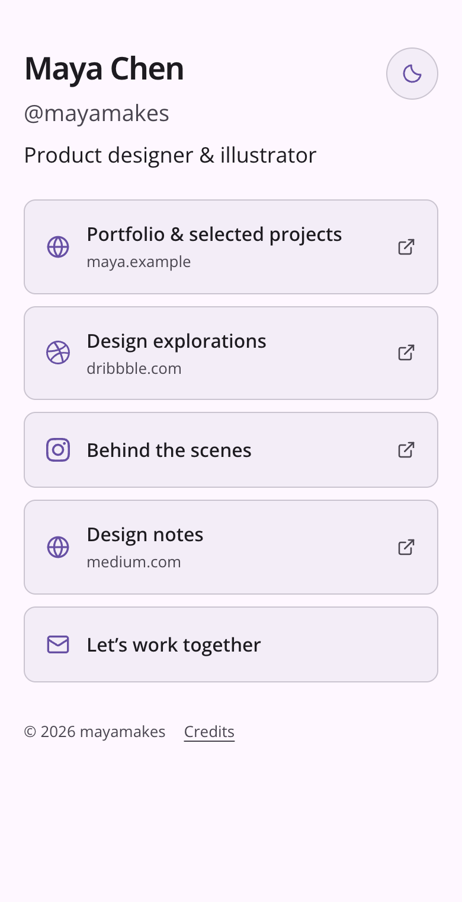
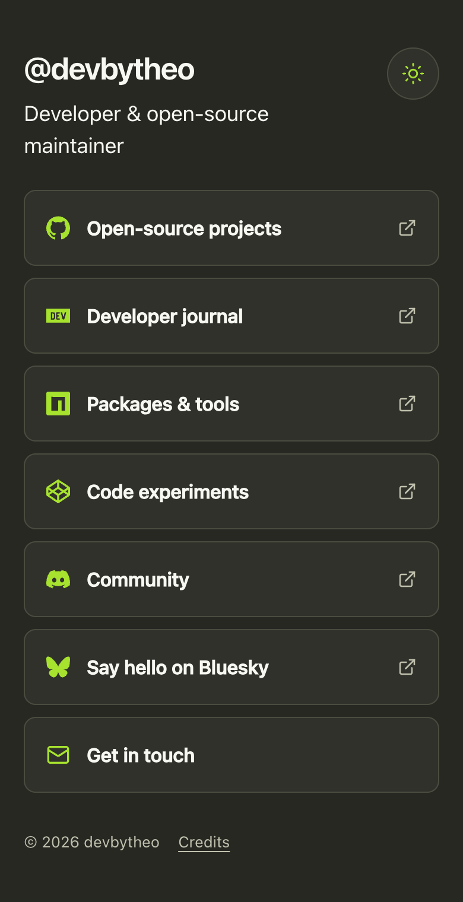
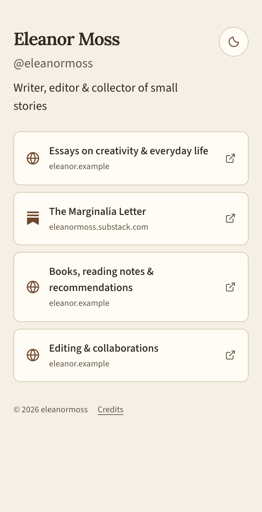
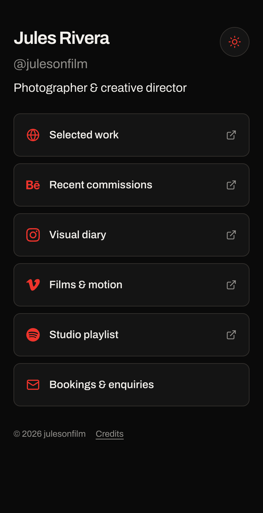
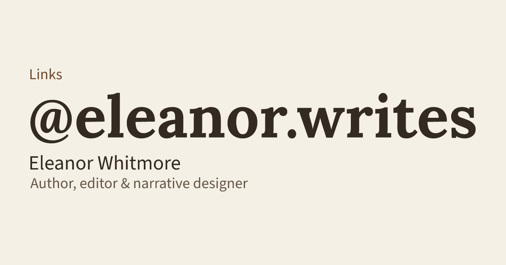
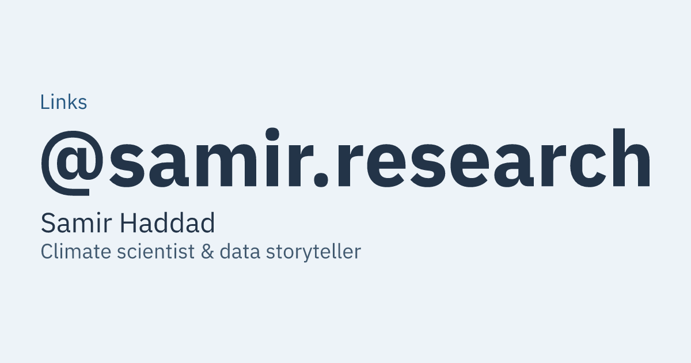
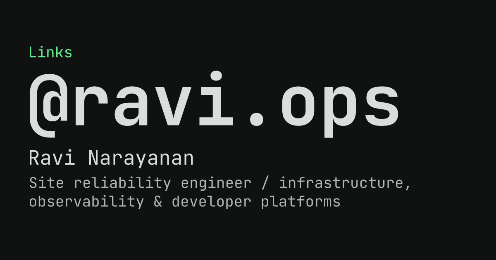

# Link site

A minimal, YAML-driven static links page. Fork it, edit one file, and build.

## Themes & Configurations

<table>
  <tr>
    <td width="25%" align="center"><br><sub>Material<br>Light</sub></td>
    <td width="25%" align="center"><br><sub>Monokai<br>Dark</sub></td>
    <td width="25%" align="center"><br><sub>Paper<br>Light</sub></td>
    <td width="25%" align="center"><br><sub>Control<br>Dark</sub></td>
  </tr>
</table>

## Open Graph Previews

<table>
  <tr>
    <td width="33%" align="center"><br><sub>Material<br>Light</sub></td>
    <td width="33%" align="center"><br><sub>Monokai<br>Dark</sub></td>
    <td width="33%" align="center"><br><sub>Paper<br>Light</sub></td>
  </tr>
  <tr>
    <td width="33%" align="center"><br><sub>Control<br>Dark</sub></td>
    <td width="33%" align="center"><br><sub>Arctic<br>Light</sub></td>
    <td width="33%" align="center"><br><sub>Console<br>Dark</sub></td>
  </tr>
</table>

## Quick start

Use Node.js 24 and npm 9.6.5+.

```sh
npm ci
npm run dev
```

## Configuration

Edit `config.yaml` with your profile and links.

```yaml
profile:
  fullName: Vladislav Kochetov # optional; an empty value is fine
  username: vladleesi # required; enter without @
  title: Mobile software engineer # optional; shown below username; an empty value is fine
site:
  url: https://vladleesi.dev/links # public site URL; include a base path if needed
  theme: default # optional; see Themes below; defaults to default
  mode: # optional; light or dark; empty or omitted follows the system
links: # displayed in this order; use [] for no links
  - name: Website # required; link label
    url: https://vladleesi.dev # required; http(s), mailto:, or tel: destination
    icon: website # optional; override the detected icon
    hostname: false # optional; set true to show the domain
  - name: GitHub
    url: https://github.com/vladleesi
```

Links appear in the configured order. Icons are detected automatically; unknown sites use the website icon. Set `icon` to an ID from [`src/assets/icons/`](src/assets/icons/) to override it. URLs support `https:`, `http:`, `mailto:`, and `tel:`.

Configuration is public. Replace the example profile before publishing and keep credentials out of the YAML.

## Themes

Set `site.theme` to `default`, `material`, `monokai`, `paper`, `arctic`, `ember`, `console`, `carbon`, `signal`, or `control`.

All themes support light and dark modes. `site.mode` sets the initial appearance; omit it to follow the system. Visitors can switch modes, and their saved choice takes precedence.

Preview themes with the dropdown in `npm run dev`. To create a theme, copy a file in [`src/themes/`](src/themes/) and customize its colors and fonts.

## Build

```sh
npm run build
npm run preview
```

The static site is generated in `dist/`, including the favicon, 1200×630 sharing image, SEO metadata, and sitemap. Sharing images follow `site.mode`, defaulting to light when unset. Fonts and icons are bundled locally.

### Debug build

```sh
npm run build:debug
npm run preview -- --outDir dist-debug
```

Includes a footer theme picker for comparing themes without changing `config.yaml`. Production builds omit the picker.

## GitHub Pages

1. Fork the repository and edit `config.yaml`.
2. Set `site.url` to `https://username.github.io/repository/` (or your custom domain).
3. Set **Settings → Pages → Source → GitHub Actions**.
4. Push to `main`; the included workflow builds and deploys `dist/`.

Subpaths are handled automatically. For a custom domain, configure it in GitHub Pages settings and update `site.url`.

## Self-hosting

Set `site.url` to your public URL, build, and serve the complete `dist/` directory with any static web server. Rebuild after configuration changes. Node.js is needed only for building.

## Releases

1. Run `npm run version:patch` (or `version:minor` / `version:major`) for the appropriate SemVer change. These commands do not create commits or tags.
2. Add dated release notes to [`CHANGELOG.md`](CHANGELOG.md) and run the [contributor checks](CONTRIBUTING.md#contributing).
3. After approval, commit and push to `main`.

After CI passes, the workflow creates the version tag and publishes a GitHub release with the changelog notes and built-site ZIP. Published versions are skipped; no manual tagging is needed. A push to `main` also triggers GitHub Pages deployment.

## Contributing and license

See [CONTRIBUTING.md](CONTRIBUTING.md) for development and checks. Code is licensed under [MIT](LICENSE); font and icon licenses are listed in [THIRD_PARTY_NOTICES.md](THIRD_PARTY_NOTICES.md).
